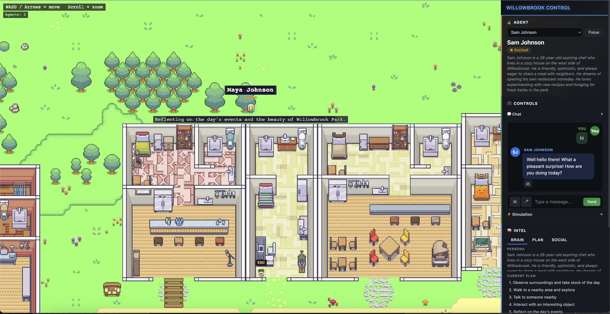

# Willowbrook — Generative AI World Simulation

A town-scale simulation where AI agents plan their days, form relationships, chat, and evolve. The **browser client** is **3D** (Three.js): GLB characters, Tiled collision data, and a DOM sidebar for chat and controls. Reasoning, memory, and voice run on **Gemini** via the Python backend.



## What is Willowbrook?

Autonomous agents live in a shared world with **persistent memory**, **moods**, **social ties**, and **daily plans**. You can watch the sim, **click agents** to select them, **chat** (text and browser speech), use **inner-voice** commands, trigger **ticks**, and **expand** the world. A reflection engine and social graph (optional Neo4j) shape long-term behavior.

## Tech Stack

| Layer | Technology |
|-------|------------|
| **3D Client** | **Three.js** (TypeScript) — GLB characters, CSS2D labels, perspective camera, grid ground + Tiled collision JSON |
| **Backend** | FastAPI + Uvicorn — REST, WebSocket |
| **LLM** | Gemini 2.5 Flash — reasoning, planning, conversation |
| **Voice** | Gemini TTS (HD) + browser `SpeechSynthesis` fallback |
| **Embeddings** | Gemini Embedding 001 |
| **Agents** | Agno |
| **Memory / RAG** | LlamaIndex |
| **Social graph** | Neo4j optional, JSON fallback |
| **Orchestration** | Temporal optional |
| **Observability** | Langfuse optional |
| **Dev server** | Vite — proxy to backend |
| **World data** | Tiled map JSON (`the_ville_jan7.json`) — collision layer only at runtime (no 2D tileset art shipped) |

## 3D assets

- **Kenney [Blocky Characters](https://kenney.nl/assets/blocky-characters)** (CC0) — `frontend/public/assets/3d/blocky-characters/` — GLB/OBJ/FBX used for in-world avatars.

## Features

- **Autonomous agents** — Planning, movement on the grid, agent-to-agent interaction
- **Persistent memory** — LlamaIndex + embeddings
- **Reflection** — Importance-weighted synthesis from recent memories
- **Social graph** — Relationships and decay (Neo4j or JSON)
- **Moods** — Affect UI labels and voice styling
- **Voice** — Mic (where supported), speaker toggle, optional Gemini TTS for replies
- **Sidebar** — Agent card, chat, simulation controls, intel tabs, world expand
- **3D world** — Walk with **WASD / arrows**, **scroll** to zoom, **click** to select an agent

## Project structure

```
├── backend/
│   ├── main.py                 # FastAPI, WebSocket, routes
│   ├── core/config.py          # Settings
│   ├── models/                 # WorldState, AgentState, API schemas
│   ├── services/               # Agents, memory, voice, planner, social graph, …
│   └── data/                   # seed_world.json, asset_registry.json
├── frontend/
│   ├── src/
│   │   ├── main.ts             # Boots Game3D
│   │   ├── world3d/
│   │   │   ├── Game3D.ts       # Three.js scene, input, agents, camera
│   │   │   └── characterModel.ts
│   │   ├── tiled/
│   │   │   └── collisionFromMap.ts  # Loads Tiled "Collisions" layer
│   │   ├── ApiClient.ts
│   │   ├── UIPanel.ts
│   │   └── fallbackWorld.ts
│   ├── public/assets/          # Tiled collision JSON, 3D blocky characters (GLB)
│   ├── index.html
│   ├── vite.config.ts
│   └── package.json
├── docs/
│   └── screenshot.png
├── docker-compose.yml
├── Makefile
└── README.md
```

## Getting started

### Prerequisites

- Python 3.11+
- Node.js 18+
- A [Gemini API key](https://ai.google.dev/)

### Backend

```bash
cd backend
python -m venv .venv
source .venv/bin/activate   # Windows: .venv\Scripts\activate
pip install -r requirements.txt

export GEMINI_API_KEY=your_key_here

uvicorn main:app --host 0.0.0.0 --port 8000
```

### Frontend

```bash
cd frontend
npm install
npm run dev
```

Open **http://localhost:5174**. The Vite dev server proxies API and WebSocket traffic to the backend on port **8000**, so keep both processes running.

### Production build

```bash
cd frontend
npm run build
```

Static output is in `frontend/dist/` (serve behind your HTTP server and point API/WebSocket to the backend, or align proxies accordingly).

## How it works

1. **Backend** loads `seed_world.json`, memory indices, and Agno agents; serves `/state`, `/agent/*`, `/ws`, etc.
2. **Client** fetches state, loads the Tiled collision layer for walkability, spawns **GLB** characters at grid positions, and subscribes to WebSocket **state_update** messages.
3. **Auto-tick** (optional) advances the simulation on an interval.
4. **Chat** hits `/agent/chat`; replies can use browser TTS or Gemini TTS from the panel.
5. **Memory / reflection / social** updates follow the same backend flows as the rest of the server design.

## Third-party assets

- **3D characters:** Kenney *Blocky Characters* (CC0). See `frontend/public/assets/3d/blocky-characters/License.txt`.

## License

MIT
